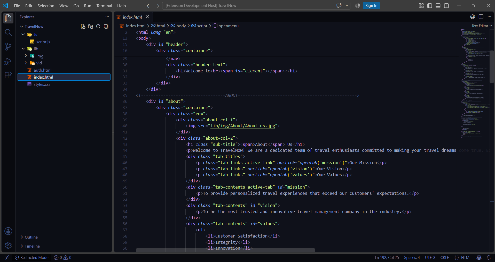
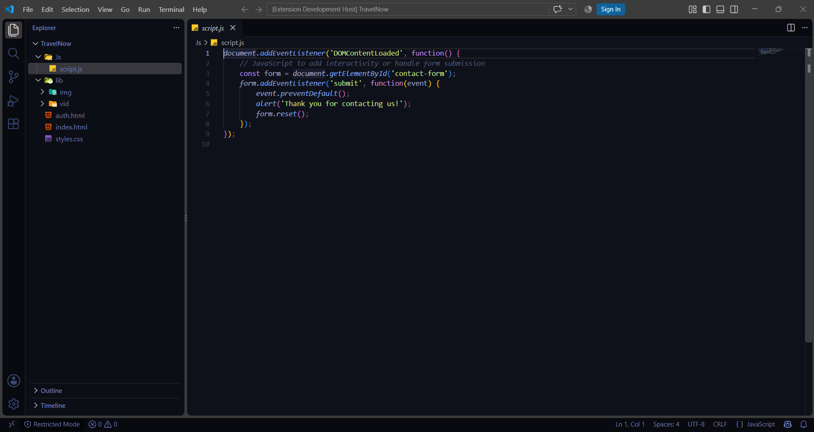

# Starveil Theme

A modern, space-inspired dark theme for Visual Studio Code, designed with matte deep-space backgrounds, soft pastel syntax highlighting, and a clean, immersive coding experience.

## Previews

### Web Development (HTML)

### App Logic & Scripting (JavaScript)

## Features

* **Deep Cosmic Void UI:** Designed with a refined matte dark blue-grey palette (`#0F111A`) to reduce eye strain during long coding sessions.
* **Balanced Syntax:** Features soft lavenders, starlight blues, and muted punctuation so your code takes center stage without harsh, distracting neons.
* **Integrated States:** Includes tailored hover states, active selections, Git status indicators, and custom terminal ANSI colors.

## Installation

1. Open VS Code and navigate to the **Extensions** view (`Ctrl+Shift+X`).
2. Search for **Starveil**.
3. Click **Install**.
4. Go to **File > Preferences > Color Theme** (or press `Ctrl+K` then `Ctrl+T`) and select **Starveil**.